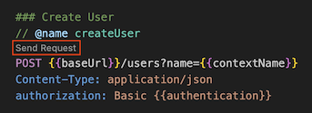

# oxcloud-rest
A simple playground for OXCloud provisioning via REST API

### Scope
This repository contains a "playground" for the OXCloud Provisioning REST API.

### Disclaimer
There is no expectation at all that this playground is complete and functional all the time. Its main purpose is to provide examples and concepts how the API is to be used.

### Prerequisites
- [VSCode](https://code.visualstudio.com) (free)
- [REST Client](https://marketplace.visualstudio.com/items?itemName=humao.rest-client) (free)
- A brand admin and brand auth for OX Cloud

### Configuration
For several reasons, a few values are not configured in the playground itself but in the REST client's settings. This has the additional benefit that you can quickyl switch between configurations via a popup in the lower right of VS Code's window.

In VS Code, open the Command Palette (Ctrl+Shift+P on Windows, Cmd+Shift+P) on Mac and type/choose "Preferences: Open User Settings (JSON)". Configure as many configurations as desired. Settings with one configuration "Sandbox" would look like this:

```
    "rest-client.environmentVariables": {
        "Sandbox": {
            "host": "https://some.appsuite.cloud",
            "brand": "myBrand",
            "brandAuth": "myAuth",
            "emailDomain": "myDomain",
            "contextShortName": "myContext"
        }
    }

```

### Usage
When opening CloudApi.http in VS Code, each call to an endpoint has a "Send Request" button above its HTTP method name. Clicking on this sends the request.



#### Provisioning API
The first calls are about the creation, deleting and altering contexts and users.

#### Infostore API (a.k.a. HTTP API)
The infostore API can be used to solve common questions like "how do I create a default signature for a user?".
Please note that basically all calls to the infostore API require a valid session. The creation of a session is the top most call in Infostore section of the playground.
By naming this call and referencing the response in subsequent calls, the returned session can be used like this: ...`&session={{httpLogin.response.body.session}}`. The same is true for passing the cookies in the request's header.